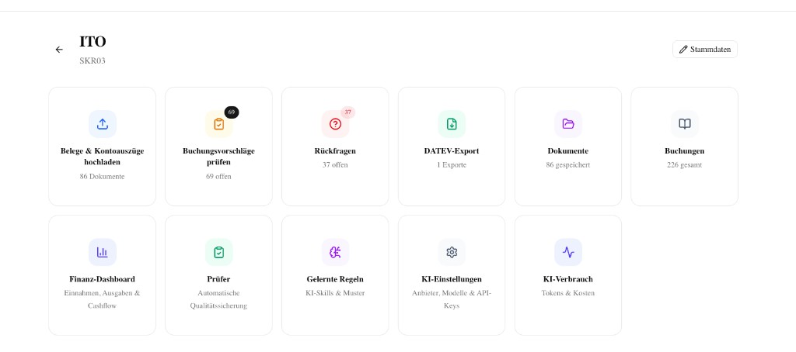
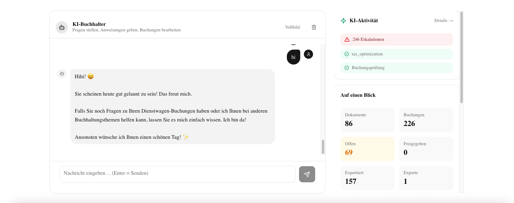

# AI Accounting

AI-powered accounting assistant for the German market. Upload receipts and invoices, receive automatic booking suggestions, review and approve them, and generate DATEV-compliant EXTF exports — all through a modern web interface with a built-in conversational AI chat.

## Screenshots

**Client Dashboard** — All accounting functions at a glance



**AI Chat** — Conversational accounting assistant with tool access



## Features

- **Document Processing Pipeline** — Upload invoices, receipts, or bank statements. OCR extracts the data, AI classifies the document and generates booking entries automatically.
- **Multi-Client Support** — Manage multiple clients (Mandanten) with individual chart of accounts (SKR03/SKR04), bank accounts, and AI settings.
- **Booking Review & Approval** — All AI-generated bookings land in a review queue. Approve, edit, or reject them before export.
- **DATEV Export** — Generate DATEV-compliant EXTF files ready for import into DATEV or other German accounting software.
- **Conversational AI Chat** — Ask questions, trigger bookings, validate VAT IDs, run Python analysis, or search the web — all from a chat interface scoped to each client.
- **Per-Client AI Configuration** — Choose LLM providers (Anthropic, Mistral, OpenAI) and models per client. API keys are stored encrypted.
- **Autonomous Supervisor** — Background process that retries failed OCR, validates bookings, and flags stale documents.
- **Financial Dashboard** — Visual overview of revenue, expenses, open items, and key accounting metrics per client.
- **Skills System** — Domain-specific rules (SKR03 accounts, posting keys, tax codes) stored as Markdown and used by the AI for accurate bookings.
- **Clarification Workflow** — When the AI is unsure, it creates clarification requests for human review instead of guessing.

## Tech Stack

| Layer | Technology |
|---|---|
| Frontend | Next.js 16, React 19, shadcn/ui, Tailwind CSS 4, Recharts |
| Backend | FastAPI, Python 3.12, SQLAlchemy 2 (async), Alembic |
| AI Orchestration | LangGraph, LangChain Core |
| LLM Gateway | litellm (Anthropic, Mistral, OpenAI) |
| OCR | Mistral OCR with Claude Vision fallback |
| Database | PostgreSQL 16 |
| Code Execution | Sandboxed Python runner (isolated Docker service) |
| Observability | LangSmith (optional, off by default for GDPR) |

## Prerequisites

- **Docker Desktop** — [Download for Mac / Windows / Linux](https://www.docker.com/products/docker-desktop/) (includes Docker Compose v2)
- API keys for at least **Anthropic** and **Mistral** (see [Getting API Keys](#getting-api-keys))
- Optional: OpenAI API key, Tavily API key (web search in chat), LangSmith API key (tracing)

## Quick Start

### 1. Clone and configure

```bash
git clone https://github.com/your-username/ai-accounting.git
cd ai-accounting
cp .env.example .env
```

Open `.env` and fill in your API keys. At minimum you need:

```env
ANTHROPIC_API_KEY=sk-ant-...
MISTRAL_API_KEY=...
```

See [Environment Variables](#environment-variables) for the full list.

### 2. Start all services

```bash
docker compose up --build
```

This starts four services:
- **PostgreSQL** — Database
- **Backend** — FastAPI server (runs migrations automatically on startup)
- **Frontend** — Next.js dev server
- **Code Runner** — Sandboxed Python execution service

### 3. Open the app

| Service | URL |
|---|---|
| Frontend | [http://localhost:3000](http://localhost:3000) |
| Backend API | [http://localhost:8000](http://localhost:8000) |
| API Docs (Swagger) | [http://localhost:8000/docs](http://localhost:8000/docs) |
| Health Check | [http://localhost:8000/health](http://localhost:8000/health) |

### 4. Get started

1. Create a new client from the dashboard
2. Upload a document (invoice, receipt, or bank statement)
3. Wait for OCR and AI processing to complete
4. Review the generated booking suggestions
5. Approve bookings and export to DATEV

## Environment Variables

Configure these in your `.env` file (copy from `.env.example`):

| Variable | Required | Description |
|---|---|---|
| `ANTHROPIC_API_KEY` | Yes | Anthropic API key for Claude models |
| `MISTRAL_API_KEY` | Yes | Mistral API key for OCR and models |
| `OPENAI_API_KEY` | No | OpenAI API key (alternative LLM provider) |
| `TAVILY_API_KEY` | No | Tavily API key for web search in chat |
| `LANGSMITH_API_KEY` | No | LangSmith API key for tracing |
| `LANGCHAIN_TRACING_V2` | No | Enable LangSmith tracing (`true`/`false`, default: `false`) |
| `LLM_KEY_ENCRYPTION_SECRET` | No | 64-char hex string for encrypting per-client API keys. Generate with: `python -c "import os; print(os.urandom(32).hex())"` |
| `THINKING_BUDGET_TOKENS` | No | Token budget for extended thinking (default: `8000`) |
| `NEXT_PUBLIC_API_URL` | No | Backend URL as seen by the browser (default: `http://localhost:8000`) |
| `DATABASE_URL` | No | Async DB connection string (has a working default for Docker) |
| `POSTGRES_USER` | No | Postgres user (default: `postgres`) |
| `POSTGRES_PASSWORD` | No | Postgres password (default: `postgres`) |
| `POSTGRES_DB` | No | Postgres database name (default: `buchhaltung`) |

## Getting API Keys

You need API keys from at least two providers. Both offer free trial credits for new accounts.

| Provider | Sign Up | Where to Find Your Key |
|---|---|---|
| **Anthropic** (required) | [console.anthropic.com](https://console.anthropic.com/) | Sign up → Dashboard → **API Keys** → Create Key |
| **Mistral** (required) | [console.mistral.ai](https://console.mistral.ai/) | Sign up → **API Keys** → Create Key |
| **OpenAI** (optional) | [platform.openai.com](https://platform.openai.com/) | Sign up → **API Keys** → Create Key |
| **Tavily** (optional) | [tavily.com](https://tavily.com/) | Sign up → Dashboard → **API Key** |

## Cost Estimate

This application uses paid AI APIs. Costs depend on document volume and complexity.

| Operation | Approximate Cost |
|---|---|
| OCR + booking suggestion per document | ~$0.01 – $0.05 |
| 100 documents (invoices/receipts) | ~$1 – $5 |
| Chat conversation (per message) | ~$0.01 – $0.03 |

These are rough estimates based on current API pricing (Anthropic Claude Sonnet, Mistral). Actual costs vary by document size, model choice, and whether extended thinking is enabled. Monitor your usage on each provider's dashboard.

> **Tip:** Start with a small batch of documents to understand your cost profile before processing large volumes.

## Project Structure

```
ai_accounting/
├── frontend/                # Next.js 16 (App Router, TypeScript)
│   ├── src/app/             # Pages and layouts
│   ├── src/components/      # UI components (shadcn/ui)
│   └── src/lib/             # API client, utilities
├── backend/                 # FastAPI + LangGraph
│   ├── app/
│   │   ├── main.py          # FastAPI app, CORS, startup
│   │   ├── config.py        # Settings (env vars via pydantic-settings)
│   │   ├── database.py      # SQLAlchemy engine & session
│   │   ├── models/          # SQLAlchemy ORM models
│   │   ├── schemas/         # Pydantic request/response schemas
│   │   ├── routers/         # API route handlers
│   │   ├── services/        # Business logic (OCR, DATEV, chat agent, etc.)
│   │   ├── graph/           # LangGraph document processing workflow
│   │   └── skills/          # Domain knowledge as Markdown (SKR03, posting keys)
│   ├── alembic/             # Database migrations
│   ├── tests/               # pytest test suite
│   └── requirements.txt     # Python dependencies
├── code-runner/             # Sandboxed Python execution service
│   ├── main.py              # FastAPI server for code execution
│   ├── Dockerfile
│   └── requirements.txt
├── uploads/                 # Uploaded documents (Docker volume mount)
├── exports/                 # Generated DATEV exports (Docker volume mount)
├── doc/                     # Additional documentation
├── docker-compose.yml       # All services orchestration
└── .env.example             # Environment variable template
```

## API Overview

The backend exposes a RESTful API under `/api/v1`. Full interactive documentation is available at `/docs` (Swagger UI).

### Core Endpoints

| Method | Path | Description |
|---|---|---|
| `GET` | `/health` | Health check |
| `POST` | `/api/v1/clients` | Create a client |
| `GET` | `/api/v1/clients` | List all clients |
| `GET` | `/api/v1/clients/{id}` | Get client details |
| `PATCH` | `/api/v1/clients/{id}` | Update a client |
| `POST` | `/api/v1/documents/upload` | Upload a document |
| `GET` | `/api/v1/documents` | List documents |
| `GET` | `/api/v1/documents/{id}` | Get document details |
| `GET` | `/api/v1/bookings/review` | Get review queue |
| `POST` | `/api/v1/bookings/{id}/approve` | Approve a booking |
| `PATCH` | `/api/v1/bookings/{id}` | Edit a booking |
| `POST` | `/api/v1/exports/datev` | Generate DATEV export |
| `GET` | `/api/v1/dashboard` | Financial dashboard data |

### Client-Scoped Endpoints

| Method | Path | Description |
|---|---|---|
| `GET/POST` | `/api/v1/clients/{id}/bank-accounts` | Manage bank accounts |
| `POST` | `/api/v1/clients/{id}/chat` | Chat with the AI accountant |
| `GET/POST` | `/api/v1/clients/{id}/clarifications` | Manage clarification requests |
| `GET/PUT` | `/api/v1/clients/{id}/ai-settings` | Per-client AI configuration |

### Skills & Agent

| Method | Path | Description |
|---|---|---|
| `GET` | `/api/v1/skills` | List available skills |
| `POST` | `/api/v1/agent/supervisor/run` | Trigger a supervisor cycle |
| `GET` | `/api/v1/agent/runs` | List agent run history |

## Database Migrations

Migrations run automatically when the backend starts. For development:

```bash
# Create a new migration after model changes
docker compose exec backend alembic revision --autogenerate -m "description"

# Apply pending migrations manually
docker compose exec backend alembic upgrade head

# Downgrade one step
docker compose exec backend alembic downgrade -1
```

## Development

### Adding Frontend Dependencies

Because `node_modules` lives in a named Docker volume, install new packages with:

```bash
docker compose run --rm frontend npm install <package-name>
```

### Accessing the Database

PostgreSQL is exposed on host port **5433** (not the default 5432):

```bash
psql -h localhost -p 5433 -U postgres -d buchhaltung
```

### Running Tests

```bash
docker compose exec backend pytest
```

### Architecture Notes

The document processing pipeline is implemented as a **LangGraph** state machine:

```
Upload → OCR (Mistral) → Fallback OCR (Claude Vision, if needed)
       → Classification → Booking Suggestion → Validation → Persist
```

The **Chat Agent** uses LangChain tools to interact with the system — it can look up bookings, approve entries, search documents, execute Python code (via the sandboxed code-runner), validate VAT IDs, and query the web.

The **Supervisor** runs as a background task (configurable interval, default 120s) and handles retry logic for failed OCR, booking validation, and detection of stale documents.

## Troubleshooting

### Docker is not running

```
error during connect: Cannot connect to the Docker daemon
```

Make sure Docker Desktop is running. On Mac, check the Docker icon in the menu bar.

### Port already in use

```
Bind for 0.0.0.0:3000 failed: port is already allocated
```

Stop whatever is using the port, or shut down a previous run first:

```bash
docker compose down
docker compose up --build
```

### Backend won't start / keeps restarting

Check the logs for the specific error:

```bash
docker compose logs backend
```

Common causes:
- Missing or invalid API keys in `.env`
- Database not ready yet (usually resolves itself after a few seconds)

### Database migration errors

If the database schema is out of sync:

```bash
docker compose exec backend alembic upgrade head
```

To start completely fresh:

```bash
docker compose down -v   # removes all data!
docker compose up --build
```

### Frontend shows "Network Error" or blank page

Make sure `NEXT_PUBLIC_API_URL` in your `.env` is set to `http://localhost:8000` (the backend URL as seen from your browser, not from inside Docker).

### OCR fails on a document

- Check that your `MISTRAL_API_KEY` is valid and has credits
- The system will automatically retry with Claude Vision as fallback
- Very large or low-quality scans may fail — try re-scanning at higher resolution

## License

This project is licensed under the [MIT License](LICENSE).
